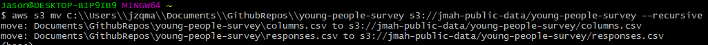

# Youth Survey Tableau Dashboard 

# Preface 
This README documents about the project and future plan for development. To check out my other Tableau Dashboards, please click [here](https://github.com/AspiringDSer/COVID19_Tableau_Dashboard)

# Table of Content 
1. [Motivation](#Motivation)
2. [About the Project](#About-the-Project)
3. [Future Developments](#Future)

# Motivation 
There is an ever growing need to effectively clean and analyze customer data. Surveys is one form of a customer data source. I have taken a [Kaggle Dataset](https://www.kaggle.com/miroslavsabo/young-people-survey) that contains youth questionnarie information and preprocessed it. Next, I made a Tableau Dashboard visualize the cleaned data.  

# About the Project 

[Tableau Public](https://public.tableau.com/views/YouthSurvey_16293005874810/Dashboard1?:language=en-US&publish=yes&:display_count=n&:origin=viz_share_link)

Note: I have attached the Tableau Workbook, so one can view the Dashboard in the Workbook as well.

**API** 

In attempt to mimic real-life datasets, I have uploaded the Youth Survey Dataset to a s3 bucket `jmah-public-data`. Instead of downloading CSV files and read from local, we will read the data directly from the Cloud. This also allows Users to easily create copies of the datasets. I have created a custom-build class called `Survey` to manipulate our data. 

**Data Wrangling** 

I used Python to clean the data. I needed to create a completely new dataframe in order to allow Tableau to visual the data. Once the data was preprocessed, I exported it into CSV file, `survey.csv`.  

**Tableau Dashboard**

As you can see from the [image](#About-the-Project) above, the Dashboard has the ability to filter various features: Questionnaire Set, Gender, and Age (bins). Participants choose from a range from 1 to 5. 1 being strongly disagree and 5 being strongly agree. The cleaned dataset has other features that the Dashboard can filter on, however, I will implement those filters in the future. 

# Future Developments 
The Survey Dashboard Project still needs further refinement. I plan continue development in these areas:

* Change Float Answers to Integers 
* Adding More Filters to Dashboard
* Add Participant Counter to Dashboard 
